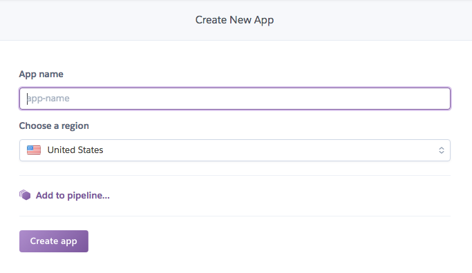
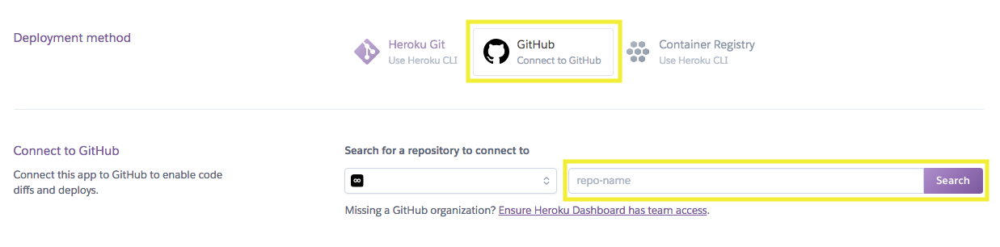
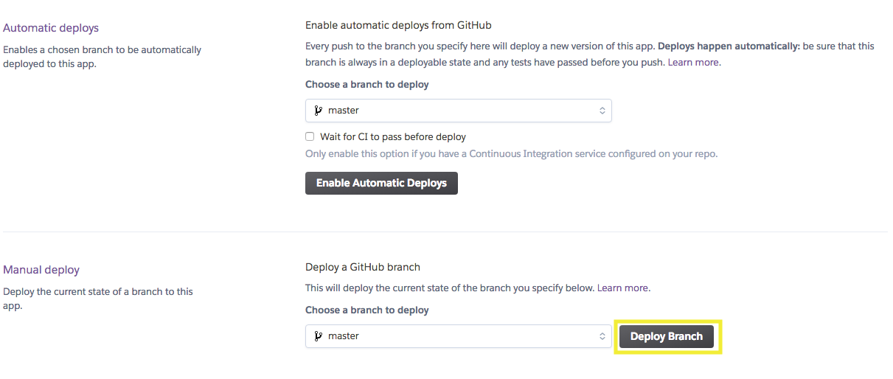
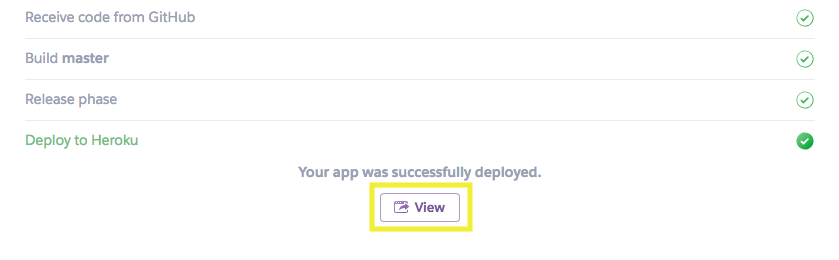

# How to Get My App to Heroku

To get your Python app deployed to Heroku is easier than you might think.  You just need a few things to setup and configure to make it happen.

### Things you will need
- A Heroku account
- A new git repo just for your app
- Favorite beverage of choice
- Four deep breaths *(reuse at anytime)*

## Background

Heroku is powerful platform that supports the development, deployment and runing of applications of all shapes and sizes written in Node, Java, PHP, Python and more.  There are pages and pages of documentation, tutorials and getting started guides.

For your application, what is needed for the configuration is two config files.  There is a requirements file ```requirements.txt``` and a startup file, know as a ```Procfile```. It tells Heroku how to open your application and run it.

The database in the project is SQLite and does not require any configuration or setup in Heroku.

The requirements file is included with the starter code in the project but it does need some minor edits.  You will need to update some version numbers and will be adding **gunicorn**.  This is a webserver that will run your Flask ```app.py``` when it is deployed to Heroku. The only new file is the startup Procfile.

###### Optional Reading: [Deploying Python Applications with Gunicorn](https://devcenter.heroku.com/articles/python-gunicorn)

### Update the Requirements.txt

This file tells Heroku all the Python libraries that your app needs to run.  They are called dependencies.  Think of it like Heroku is doing a ```pip install``` for you so that your application can run.

Find the ```requirements.txt``` that is included with the starter code and update.  Hint: ****copy & paste****

```
Click==7.0
Flask==1.0.2
Flask-SQLAlchemy==2.3.2
gunicorn==19.9.0
itsdangerous==0.24
Jinja2==2.10
MarkupSafe==1.0
numpy==1.15.2
pandas==0.23.4
python-dateutil==2.7.3
pytz==2018.5
six==1.11.0
SQLAlchemy==1.2.12
Werkzeug==0.14.1
```

### Create the Procfile

This file tells Heroku how to start and run your app.  Create a new file and name it ```Profile``` and save it your project folder.  This is the same location as the requirements file and your Python application file.

***Note:*** The Procfile does not have a file extension

Update your new ```Profile``` with the following

```
web: gunicorn app:app
```

## Push Your Code to Github

Create a new repo your application.  Later you will hook this repo to your Heroku app.  Have all the files and folders at the base or root folder.

Follow this layout for your files and folders.  This is key for a successfull deployment.

```
new-git-repo-name
├── app.py
├── db
│   ├── belly_button_biodiversity.sqlite
│   └── bellybutton.sqlite
├── Procfile
├── requirements.txt
├── static
│   └── js
│       └── app.js
└── templates
     └── index.html
```

When your are happy with you app and ready to deploy then push your code to GitHub.

## Heroku Dashboard

### Login into Heroku

### Create New App

Create a new application.  The app name has to be unique.  Do not worry, Heroku will tell you when one is already taken.  It might take a few times to fine one that has not been taken.



### Hookup Heroku wth Github

After creating the application, you will taken to the deploy page for the next step.  If you have already created a Heroku app and navigate to "Deploy" page.

Select "GitHub" as the deployment method. You will need to authorized and allow Heroku access to your GitHub account.  Once that process is completed you can connect your repo with your application.

Next, enter in the name of your repo and click on "Search"



Heroku finds your repo, click on "Connect" to finish.

### Deploy

You are ready to deploy your application.  This will take a minute or two and you can watch Heroku working.  



You can even setup automatic deployments.  When you make code changes and push them to GitHub, Heroku will automatically deploy your app for you.  Get comfortable with manual deploys first before trying automatic ones.

### View

Your app is now ready.  You have successfully deployed your application to Heroku.




## Testing and Redeploy

#### Take your application out for a test drive.

If you want to make any changes ...

- Update your code
- Test locally
- Add/Commit to your repo
- Push to GitHub
- Reploy in Heroku
